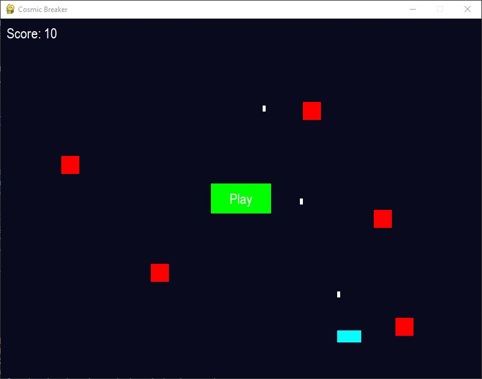
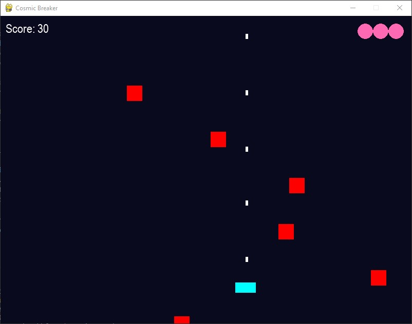
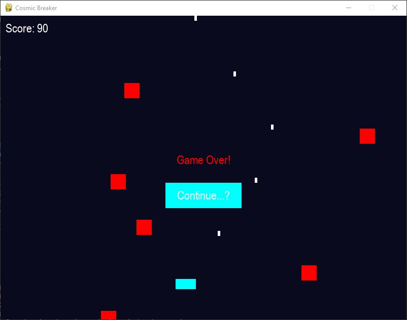

# 🚀 Cosmic Breaker

**Cosmic Breaker** is a fast-paced arcade-style asteroid shooter where the player must navigate a spaceship, dodge incoming asteroids, and destroy them for points. The game has an **idle mode** where the ship moves automatically and **manual mode** for direct player control.

## 🎮 Game Features
- **Idle Mode**: The ship moves automatically and shoots asteroids.
- **Manual Mode**: After pressing **Play**, the player can control the ship using **arrow keys** or **A/D**.
- **Asteroids & Shooting**: The ship fires bullets at a fixed rate to destroy incoming asteroids.
- **Score System**: Gain **10 points** per asteroid destroyed.
- **Lives System**: The player has **3 lives** represented as pink circles.
- **Game Over & Continue**: If all lives are lost, a **Continue button** allows the player to restart.

## 🖥️ Controls
| Action | Key |
|--------|-----|
| Move Left | ⬅️ Left Arrow / A |
| Move Right | ➡️ Right Arrow / D |
| Start Manual Mode | Click "Play" Button |
| Restart After Game Over | Click "Continue" Button |

## 📜 How to Play
1. **Idle Mode**:
   - When the game starts, the ship **moves automatically** and fires bullets at asteroids.
   - The ship dodges incoming asteroids **based on AI movement logic**.

2. **Switching to Manual Mode**:
   - Click **Play** to start **manual movement**.
   - The ship's speed **increases** to 3.5 pixels/frame.
   - The bullet rate **increases** for faster shooting.
   - The ship **no longer has movement restrictions** and can reach the screen edges.

3. **Destroying Asteroids**:
   - Each asteroid destroyed gives **10 points**.
   - Asteroids spawn from the top of the screen.

4. **Losing Lives & Game Over**:
   - If an asteroid hits the ship, **one life is lost**.
   - When all **3 lives are gone**, the **Game Over** screen appears with a **Continue button**.

5. **Restarting the Game**:
   - Click **Continue** to reset the game and start fresh.

## 🛠️ Installation & Running the Game

### **1️⃣ Install Pygame**
Ensure you have Python installed, then install Pygame:

```bash
pip install pygame
```

### **2️⃣ Clone the Repository**
```bash
git clone [https://github.com/EdwinP503/cosmic-breaker.git](https://github.com/EdwinP503/cosmic-breaker.git)
cd cosmic-breaker
```

### **3️⃣ Run the Game**
```bash
python game.py
```

## 🎨 Screenshots
  

## 📌 Future Enhancements
- **Power-Ups**: Special abilities like **piercing bullets** and **shield protection**.
- **Difficulty Levels**: Increase asteroid speed over time.
- **Background Effects**: Animated cosmic background for a better visual experience.

## 🏆 Credits
- **Developer:** Edwin Polanco  
- **Game Engine:** Pygame  
- **Language:** Python  

## 📜 License
This project is open-source under the **MIT License**.

---

🚀 **Blast through asteroids, dodge threats, and survive in Cosmic Breaker!** 🚀
